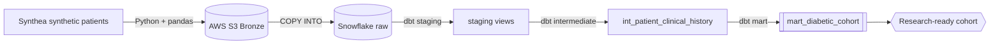

# RWE Clinical Cohort Pipeline


An end-to-end data pipeline that ingests synthetic patient records, lands them
in the cloud, and transforms them into a **research-ready patient cohort** —
the productionized, cloud-native version of clinical cohort delivery.

> All data is 100% synthetic, generated by [Synthea](https://github.com/synthetichealth/synthea).
> No real patient data, no PHI.

## The problem

Real-world-evidence (RWE) research needs reproducible patient cohorts — e.g.
"all diabetic patients, with their conditions, procedures, and active
medications." Traditionally that lives in hand-maintained stored procedures.
This project rebuilds it as a tested, version-controlled, cloud-native pipeline.

## Architecture



| Layer | Tech |
|-------|------|
| Extract | Python, requests, Synthea |
| Land (Bronze) | boto3, AWS S3 |
| Load | Snowflake external stage + `COPY INTO` |
| Transform | dbt (staging → intermediate → mart) |
| Quality | pytest + dbt tests |
| Automate | GitHub Actions CI |

## How it works

1. **Extract** — Synthea generates synthetic patient CSVs; `pipeline/extract.py` locates them.
2. **Land** — `pipeline/load_s3.py` uploads the raw CSVs to an S3 Bronze prefix (boto3, with retries).
3. **Load** — `pipeline/load_snowflake.py` runs `COPY INTO` from an external S3 stage into Snowflake raw tables.
4. **Transform** — dbt models clean each source (`staging`), join them (`intermediate`), and build the cohort (`marts/mart_diabetic_cohort`).
5. **Quality** — pytest covers the pure Python helpers; dbt schema tests enforce not_null / unique / relationships.

## Repo structure

```
pipeline/        # extract -> S3 -> Snowflake (Python)
main.py          # orchestrates the pipeline
dbt/rwe_dbt/     # dbt project (sources, staging, intermediate, marts)
tests/           # pytest unit tests
.github/workflows/ci.yml
```

## How to run

**Prerequisites:** Python 3.11+, Java 17+ (for Synthea), an AWS account, a Snowflake account.

```bash
# 1. Setup
python -m venv .venv && source .venv/bin/activate   # Windows: .venv\Scripts\activate
pip install -r requirements.txt
cp .env.example .env   # fill in your AWS + Snowflake values, then: set -a; source .env; set +a

# 2. Generate synthetic data (Java 17+)
java -jar synthea-with-dependencies.jar --exporter.csv.export=true -p 1000
# Output lands in ./output/csv/

# 3. Run the ingestion pipeline (extract -> S3 -> Snowflake)
python main.py

# 4. Transform with dbt
export DBT_PROFILES_DIR=dbt/rwe_dbt
dbt build --project-dir dbt/rwe_dbt

# 5. Explore the lineage / docs
dbt docs generate --project-dir dbt/rwe_dbt && dbt docs serve --project-dir dbt/rwe_dbt
```

## Results

<!-- Replace with your real output once the pipeline runs. -->
- **Cohort size:** _N_ diabetic patients out of _M_ total
- **Sample rows** of `mart_diabetic_cohort`: _(paste a small table here)_
- **Lineage graph:** _(add a screenshot of `dbt docs` here — `docs/lineage.png`)_

## Data quality

- Python: `pytest` unit tests on transform helpers.
- dbt: `not_null` + `unique` on patient keys, `accepted_values` on gender, `relationships` from child models back to `stg_patients`.

## CI/CD

Every push runs **ruff** (Python lint), **pytest**, and **sqlfluff** (SQL lint).
A `dbt build` job against Snowflake is included (commented out) — enable it once
you add Snowflake secrets in repo settings.

## What I'd do next

- Orchestrate with Airflow or Dagster instead of a single entrypoint.
- Incremental loads via Snowpipe + dbt incremental models.
- Parameterize the cohort definition to generate multiple condition cohorts.
- Add a PySpark transform path for large-volume processing.

## License

MIT — see [LICENSE](LICENSE).
