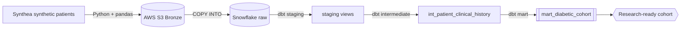

# Architecture

| Layer | Tech | What happens |
|-------|------|--------------|
| Extract | Python, requests, Synthea | Generate synthetic patient records as CSV |
| Land (Bronze) | boto3, AWS S3 | Upload raw CSVs to object storage |
| Load | Snowflake external stage + COPY INTO | Bulk-load raw files into Snowflake |
| Transform | dbt (staging → intermediate → mart) | Clean, join, and build the cohort |
| Quality | pytest + dbt tests | Unit tests + not_null / unique / relationships |
| Automate | GitHub Actions | Lint + test + (optionally) dbt build on every push |
